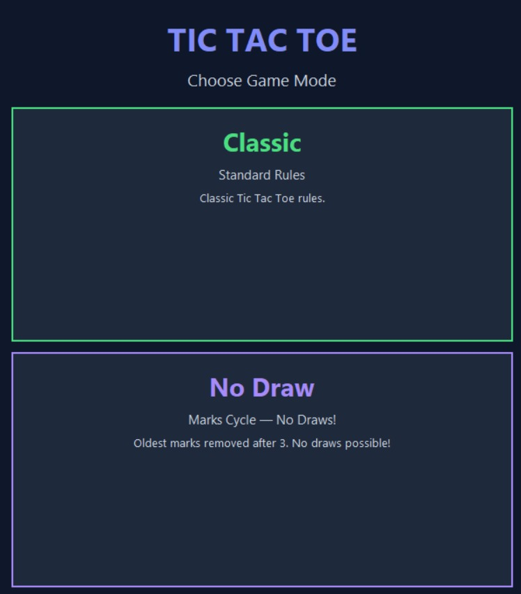

# Tic Tac Toe

- A modern, fully-featured Tic Tac Toe game built with Python and Tkinter. 
- Play against intelligent AI opponents across three difficulty levels
- Unique No-Draw mode where marks cycle and draws are impossible.

## Game Modes

### Classic Mode
- Traditional Tic Tac Toe rules. 
- First to get three in a row wins. 
- Games can end in a draw.

### No-Draw Mode
A unique twist on the classic game:
- Each player can only have **3 marks** on the board at any time
- When placing a 4th mark, your **oldest mark is automatically removed** (FIFO)
- Games continue until someone wins so **draws are impossible**
- Requires deeper strategic thinking as the board state constantly changes

## AI Difficulty Levels

| Level | Strategy | Beatable? |
|-------|----------|-----------|
| **Easy** | Random moves — picks any available cell | Yes |
| **Medium** | Reactive AI — blocks your wins, takes winning moves, otherwise random | Yes, with strategy |
| **Hard** | Minimax algorithm with alpha-beta pruning — plays optimally | No, best possible is DRAW |

The Hard AI uses:
- Full minimax search for Classic mode
- Depth-limited minimax with transposition tables and move ordering for No-Draw mode
- Heuristic evaluation for deep positions

## Screenshots




## Installation

### Prerequisites
- Python 3.8 or higher

### Setup

```bash
# Clone the repository
git clone https://github.com/username/tic-tac-toe.git
cd tic-tac-toe
```
## Usage

```bash
python main.py
```

### Controls
- **Click** any cell to place your mark (X)
- **Restart** — Start a new game with same settings
- **Menu** — Return to mode/difficulty selection
- **Reset Score** — Clear win/loss/draw statistics

### Gameplay
1. Select a game mode (Classic or No-Draw)
2. Choose difficulty (Easy, Medium, or Hard)
3. Either you or the computer randomly goes first
4. Click cells to make your moves
5. Try to get three in a row!

## Project Structure

```
tic_tac_toe/
├── main.py              
├── gui.py               
├── game_logic.py        
├── utils.py             
├── ai_easy.py           # Random move selection
├── ai_medium.py         # Win/block detection + random
├── ai_hard.py           # Minimax with alpha-beta pruning
├── pyproject.toml       
├── requirements.txt     
├── README.md           
└── tests/
    ├── test_game_logic.py   
    ├── test_ai.py          
    ├── test_utils.py       
    └── test_no_draw.py      
```

## Board Layout

```
 0 | 1 | 2
-----------
 3 | 4 | 5
-----------
 6 | 7 | 8
```

Winning combinations:
- Rows: 
  - (0,1,2)
  - (3,4,5)
  - (6,7,8)
- Columns: 
  - (0,3,6)
  - (1,4,7)
  - (2,5,8)
- Diagonals: 
  - (0,4,8) 
  - (2,4,6)

## Running Tests

```bash
# Run all tests
python -m pytest -v

# Run specific test file
python -m pytest .\tests\test_game_logic.py -v
```
